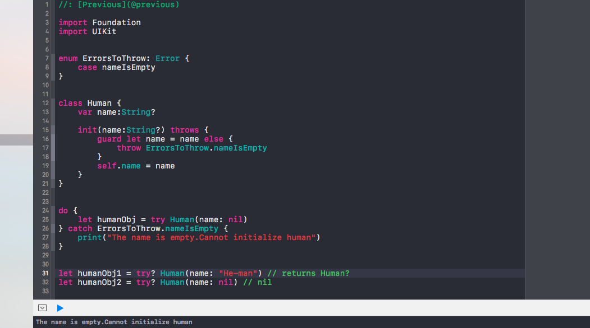

# Shopping list
## Another title

1. first
2. second
3. third



``` swift
struct ContentView: View {
    var body: some View {
        VStack {
            Image(systemName: "globe")
                .imageScale(.large)
                .foregroundColor(.accentColor)
            Text("Hello, world!")
                .titleStyle()
        }
        .padding()
    }
}
```
[make sure to read this file](readme.md)